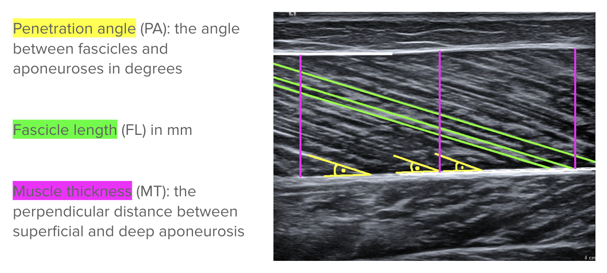
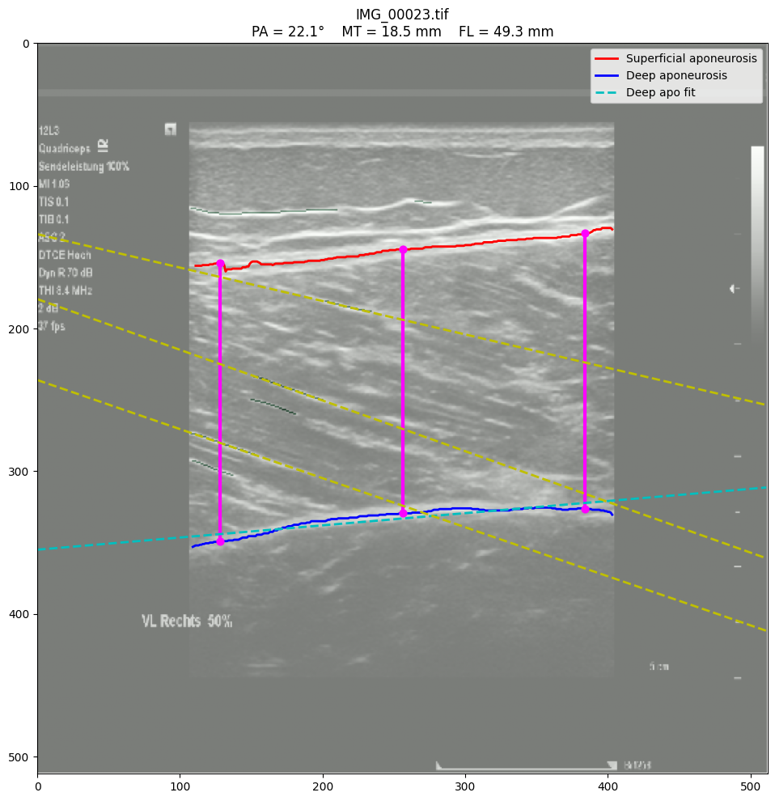

# Muscle Architecture Estimation from Ultrasound Images

In the last two days, we took on a Kaggle challenge released by a researcher interested in muscular adaptations to training and muscular development. The challenge was this: can we completely automatate the calculation of key parameters from ultrasound muscle images? Ultrasound scans are one of the most accessible diagnostic imaging techniques, but extracting useful information from them typically requires manual annotations. This is not only tedious, but also inconsistent.

Using data made available through the Universal Musculoskeletal Ultrasonography Database (UMUD), have access to 1048 images for aponeurosis 2761 images for fascicles, each with an associated mannually created mask for training. 



Initially, we were curious we could predict these three measurements directly from ultrasound images. It's never been done before in the competition, and while we didn't anticipate high performance, we were interested in using it as a baseline. However, the training data available does not contain the ground truth target metrics, just binary masks. 

Ultimately, we decided on the standard segmentation followed by geometric calculation approach. We first segmented the relevant anatomical structures (aponeuroses and fascicles) using a U-Net model. The resulting segmentation masks were then processed using classical image processing and geometric analysis to calculate the final measurements. 

This approach makes the system more interpretable because every prediction can be visually inspected before the final measurements are computed.

---

# Our Pipeline

1. Load and preprocess ultrasound images
2. Train a U-Net to segment the aponeuroses
3. Train a second U-Net to segment the fascicles
4. Clean the predicted masks using morphological operations
5. Extract the anatomical structures from the cleaned masks.
6. Compute:
   * Muscle Thickness (MT)
   * Pennation Angle (PA)
   * Fascicle Length (FL)
7. Save the final predictions to a CSV file.

Code in this repository
* apo_training.ipynb: load and preprocesses the ultrasound images, checking for inverted masks in training data, and then train the standard U-Net followed by the U-Net with attention added.
* fasc_training.ipynb: load and preprocesses with the same procedure as the aponeurosis set, with the exception that no inversion was necessary.
* postprocessing.ipynb: cleaning masks, fitting lines, computing metrics, and saving predictions
* metrics.ipynb: notebook to run evaluation metrics on our final model of choice

---

# Design Decisions

## Choosing U-Net

Both segmentation models use the same U-Net architecture, one for segmenting the aponeuroses and another for segmenting the fascicles.

Our implementation consists of four main components:

- **Encoder**
- **Bottleneck**
- **Decoder**
- **Skip connections**

The **encoder** contains three downsampling stages. Each stage consists of two 3×3 convolutional layers with ReLU activation followed by a max-pooling layer. The convolutional layers learn increasingly complex image features, while max pooling reduces the spatial resolution and allows the network to capture more abstract information. The number of filters increases from **32 → 64 → 128**.

The **bottleneck** is the deepest part of the network and contains two convolutional layers with **256 filters**. At this stage, the network has learned the highest-level representation of the image.

The **decoder** reconstructs the segmentation mask by progressively upsampling the feature maps back to the original image resolution. After each upsampling step, the feature maps are concatenated with the corresponding encoder features through **skip connections**, and two additional convolutional layers are applied. The number of filters decreases from **128 → 64 → 32**.

Finally, a **1×1 convolution with a sigmoid activation** produces a single-channel output where each pixel represents the probability of belonging to the target structure.

We chose U-Net because it is one of the most widely used architectures for biomedical image segmentation. In our brief literature review, U-Net was the go to model for it's efficiency with smaller datasets and ability to be applied across medical domains. The encoder captures both local and high-level image features, while the decoder reconstructs detailed segmentation masks. The skip connections help preserve fine spatial information that would otherwise be lost during downsampling, making U-Net particularly well suited for segmenting thin anatomical structures such as aponeuroses and fascicles.

---

## Resizing Images to 512×512

All ultrasound images and masks were resized to **512 × 512 pixels** before training. Neural networks require images with consistent input dimensions.

Choosing a resolution of 512 × 512 provided a good compromise between:

* Preserving fine anatomical details.
* Maintaining reasonable GPU memory usage.
* Keeping training times manageable.

After prediction, all measurements were converted back into millimetres using the image metadata provided by the competition.

### Alternative Approaches

#### Original Image Sizes

Training on the original image sizes would preserve all image detail, but TensorFlow batches require fixed input dimensions, making training slower and significantly more memory intensive.

#### 256 × 256

This would reduce computational cost but would also remove important details, especially for thin fascicle structures.

#### 1024 × 1024

A higher resolution could preserve more anatomical detail but would substantially increase memory usage and training time.

---

## Model Training Details

* Divide dataset into 80% training, 20% validation using a fixed random seed.
* Train both models using the **Adam** optimizer (preferred in literature because it automatically adapts the learning rate during training and generally performs well without extensive hyperparameter tuning)
* Experimentations with loss functions revealed the limitations of using just BCE. Because most pixels belong to the background, our model can appear very accurate according to BCE while still producing poor segmentation masks. As a result, our final loss function combined Binary Cross Entropy and Dice Loss:

```
Loss = BCE + Dice Loss
```

* Dice Loss directly measures the overlap between the predicted segmentation mask and the ground truth, so combining the two losses gives us BCE's stable optimization while getting better overlap optimization from Dice.
Stable optimization from Binary Cross Entropy.
* Data Augmentation: We applied these transformations across all experiments, to increase the size and diversity of our small dataset. Ideally, this helps the model learn correct generalizations without overfitting.
  * Horizontal flips
  * Small rotations
  * Random zoom
  * Random translation
* Early Stopping: training automatically stopped if the validation loss failed to improve for five consecutive epochs and the model weights corresponding to the best validation performance were restored. It's worth noting this was only relevant for our initial trained models, since later experiments (post fixing an inversion error in the training data) were time crunched and capped at 10 epochs. We likely could have achieved better results allowing the models to train for longer. The DL Track paper found 24-26 epochs was ideal for U-Net's trained on muscle ultrasounds.

---

## Classical Image Processing After Segmentation

After segmentation, we applied several traditional image processing techniques:

* Morphological cleaning
* Skeletonization
* Connected component analysis
* Line fitting
* Geometric calculations



These anatomical measurements are fundamentally geometric. Using deterministic image processing after segmentation makes every measurement transparent, reproducible, and easy to verify visually.

# Discussion of Experiments

In our hectic two-day sprint, we had some misteps in aligning our experiments. On day two, we discovered that a third of the aponeurosis training masks are inverted. Interestingly, our initial training run still achieved the highest Kaggle score despite the inverted training data. Still, we fixed the problem in preprocessing and retrained the aponeurosis and fascicle masks for both the initial U-Net and a U-Net with attention added. Because of time constraints, we only trained these for 10 epochs. The shortened training time probably factored into the lower relative performance.

| Model | Num Epochs Trained | Kaggle Score |
|---------|------------------:|---------------:|
| U-Net (no inversion checking) | **25** | **1.2653** |
| U-Net (with fixed inversion) | **10** | **1.54471** |
| U-Net with Attention | **10** | **1.49788** |

*Note that the Kaggle Score is a normalized mean absolute error (MAE) of the three target metrics, so lower is better. Because of the varying epochs, we can only directly compare the models trained on the pre-processed data (checking for inversions). The scores suggest that attention does improve the models ability to ignore background noise and focus on the importance features.

# Performance Eval

To evaluate the segmentation models, we measured both pixel-level and overlap-based metrics. While pixel accuracy provides an overall measure of correctly classified pixels, it can be misleading for highly imbalanced segmentation tasks where the background occupies most of the image. Therefore, we also report Precision, Recall, Dice Coefficient, and Intersection over Union (IoU), which better reflect the quality of the predicted segmentation masks.

| Metric | Aponeurosis Model | Fascicle Model |
|---------|------------------:|---------------:|
| Accuracy | **98.38%** | **99.42%** |
| Precision | **74.78%** | **18.47%** |
| Recall | **74.81%** | **28.21%** |
| Dice Coefficient | **0.748** | **0.223** |
| Intersection over Union (IoU) | **0.597** | **0.126** |

## Aponeurosis Model

The aponeurosis segmentation model achieved strong performance across all evaluation metrics. The Dice coefficient of **0.748** and IoU of **0.597** indicate good agreement between the predicted masks and the ground truth. Additionally, the precision and recall values are well balanced, showing that the model was able to correctly identify most aponeurosis pixels while producing relatively few false positives.

Overall, these results indicate that the model successfully learned to segment the superficial and deep aponeuroses, providing reliable inputs for the subsequent muscle architecture measurements.

## Fascicle Model

The fascicle segmentation model achieved a very high pixel accuracy (**99.42%**), but considerably lower overlap-based metrics, with a Dice coefficient of **0.223** and an IoU of **0.126**.

This difference is expected because fascicles occupy only a very small portion of each ultrasound image. As a result, correctly classifying the large background region leads to high overall accuracy even when the fascicle segmentation is imperfect. The lower precision and recall indicate that detecting the thin, fragmented fascicle structures is significantly more challenging than segmenting the larger and more continuous aponeuroses.

Despite the lower segmentation performance, the fascicle predictions remained useful after applying our post-processing pipeline. Skeletonization, connected-component analysis, filtering, and line fitting removed many spurious detections and allowed anatomically meaningful fascicle lines to be extracted for estimating pennation angle and fascicle length.


